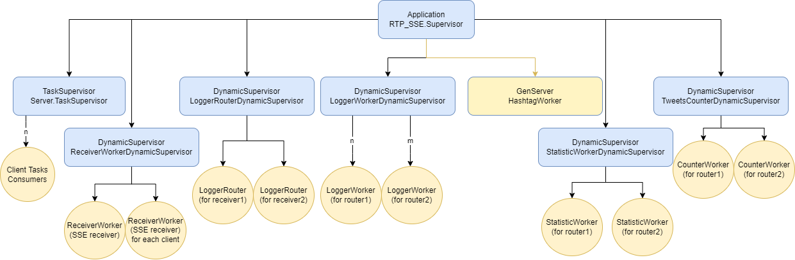
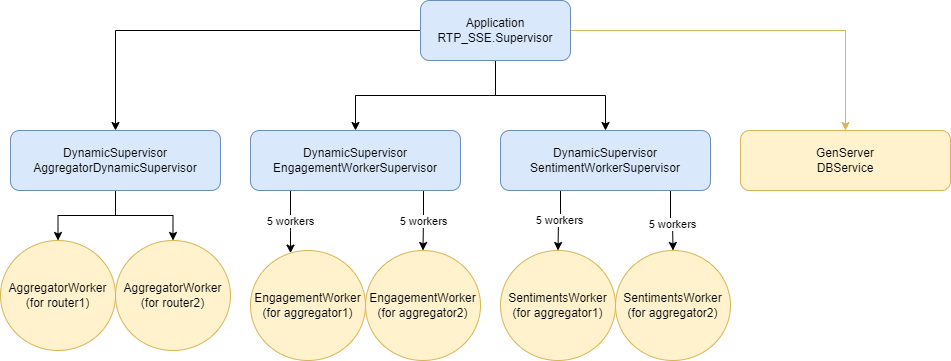
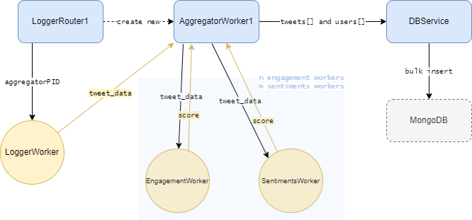

> Pasecinic Nichita
>
> Checkpoint 1 - 07.08.2022
>
> Real-Time Programming in `Elixir`


### **[`RTP_SSE` Core Actors ](./checkpoint_1.md)**

### **`TweetProcessor` Actors**

### `Aggregator`
Is started by the `Router` actor, under `TweetProcessor.AggregatorDynamicSupervisor` supervisor. So for each `Router` there will be an active `Aggregator` process.

**What it does?** 

1. Starts a few workers (described in section bellow) that will further process the tweet 
2. It receives raw `tweet_data`, it passes it its' workers in order to compute some score values based on tweet itself and it accumulates those `score` values
3. Passes the aggregated `tweets`, `users` (from state) to database service once it reaches its' internal size limit for number of processed tweets (`@max_batch_size 1000`)
4. Has a infinite recursive loop that does the above task (3) but this time using a configurable timeframe `@flush_time 3000` (actually 3 seconds is too small for a batch of 1k, probably will increase it). This flush loop is required in order not to loose data if the last chunk of processed tweets is less then `@max_batch_size`

### `EngagementWorker`
Simple worker used by `Aggregator` parent process. It calculates the engagement score of a tweet based on the following formula `score = (favorites + retweets) / followers`, it returns back to `Aggregator` the score together with all formula arguments.

### `SentimentWorker`
Another `Aggregator` worker that computes the sentiments score based on tweet text. We have [this huge](./../lib/rtp_sse/tweet_processor/emotion_values.ex) map of word-score values that we look in for each word from a tweet, `score` is equal with the mean of those values.

### `DBService`

`MongoDB` was selected to be the application database because of [the greatest elixir driver for mongodb](https://github.com/zookzook/elixir-mongodb-driver) that supports bulk writes. It is an actor (used by `Aggregator`) that has some utility methods for inserting multiple documents to `tweets` and `users` collections. It does an extremely fast `Mongo.UnorderedBulk.write` with a limit of `@max_bulk_size 500` (so 2 bulk writes / requests to Mongo for our 1k `Aggregator` limit), as well it was used `Stream` API to optimize and reduce the memory usage even more.


### **Usage**

```bash
# Compile the project and start a new `iex` session inside it
$ iex -S mix
```

```elixir
# Start the builtin observer tool
iex(1)> :observer.start()
```

```bash
# Connect via telnet (any other client) to the server
$ telnet localhost 8080
```

```bash
# run the twitter command
twitter
```


### **Supervisor diagram** `v3`



### **Extended with**



### **Message exchange** (only for extended supervisor diagram)


