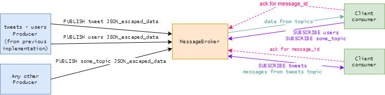

> Pasecinic Nichita
>
> Real-Time Programming in `Elixir`


`MessageBroker` is TCP server running on port `8000` created with [erlang `:gen_tcp` module](https://www.erlang.org/doc/man/gen_tcp.html), any client / producer can connect to it via a tool like `telnet` or `netcat`.

```bash
$ telnet localhost 8000 # if running the app locally 
```

The list of commands is defined in [config.ex](../config/config.exs):

* `PUBLISH` - publish a message to a topic, if topic does not exist it will create it, usage: `PUBLISH topic JSON_escaped_data` (e.g.: `PUBLISH tweets "{\"id_str\":\"123\",\"msg\":\"test\"}"`)

* `SUBSCRIBE` - subscribes a client to a topic, respond with error message if topic does not exist, usage: `SUBSCRIBE topic` (e.g.: `SUBSCRIBE tweets`)

* `UNSUBSCRIBE` - unsubscribes a client from a topic, usage: `UNSUBSCRIBE topic` (e.g.: `UNSUBSCRIBE tweets`)

* `ACKNOWLEDGE` - notifies the `MessageBroker` about a successful delivered message from subscriber, usage: `ACKNOWLEDGE topic message_id` (e.g.: `ACKNOWLEDGE tweets 123`)

  

### **`MessageBroker` message exchange diagram**

