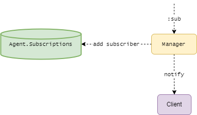

> Pasecinic Nichita
>
> Real-Time Programming in `Elixir`


`MessageBroker` is TCP server running on port `8000` created with [erlang `:gen_tcp` module](https://www.erlang.org/doc/man/gen_tcp.html), any client / producer can connect to it via a tool like `telnet` or `netcat`.

```bash
$ telnet localhost 8000 # if running the app locally 
```

The list of commands is defined in [config.ex](./config/config.exs) (using a shorthand command for dev mode, but those
can be easily changed):

* `pub` (`PUBLISH`) - publish a message to a topic, if topic does not exist it will create it,
  usage: `pub topic JSON_escaped_data` (e.g.: `pub tweets {"id":"1", "priority": 3, "msg":"tweet 1"}`)
* `sub` (`SUBSCRIBE`) - subscribes a client to a topic, respond with error message if topic does not exist,
  usage: `sub topic` (e.g.: `sub tweets`)
* `unsub` (`UNSUBSCRIBE`) - unsubscribes a subscriber from a topic, usage: `unsub topic` (e.g.: `unsub tweets`)
* `ack` (`ACKNOWLEDGE`)- notifies the `MessageBroker` about a successful delivered message from subscriber,
  usage: `ack topic event_id` (e.g.: `ack tweets 1`)

Each received event for a `pub` command is expected to be of an [`DTO.Event`](./lib/message_broker/dtos/event.ex) format.  For each topic is created a log file with the topic name (e.g.: `tweets.json`), the `logs` directory is git-ignored. An example of how this a topic log file is structure is the [`logs.public.json`](./logs.public.json) file:

```json
// tweets.json
{
  "subscriber": [
    {
      "timestamp": 1650054011933,
      "priority": 5,
      "msg": "msg",
      "id": "1"
    },
    {
      "timestamp": 1650054144283,
      "priority": 4,
      "msg": "msg",
      "id": "2"
    }
  ]
}
// real tweets.json
{
  "#Port<0.6>": [
    {
      "timestamp": 1650308403348,
      "priority": 6,
      "msg": "tweet text",
      "id": "042"
    },
    {
      "timestamp": 1650308398178,
      "priority": 6,
      "msg": "tweet text",
      "id": "04c"
    }
  ]
}

```

 The key is the subscriber/client, it can be used any client identifiers, now using the [`Elixir` Port](https://hexdocs.pm/elixir/1.13/Port.html) for the subscriber connection (e.g.: `#Port<0.5>`), and the values is list (our Priority queue) of events that did not received yet an acknowledgment from subscriber (`ack` command).

### **`MessageBroker` actors**

- `Server` - TCP server, not really an actor, but it spawns new `Task`s for the subscribers and publishers connection to the message broker
- `Manager` - The first actor to get the command from subscriber/publisher and somehow process it (add topic, check subscription), lays the ground for the command to be further processed
- `WorkerPool` - generic WP implementation, used to spawn a `Worker.Controller` workers
- `Worker.Controller` - multiple workers that handles the client commands (`:pub, :unsub, :ack`)
- `Util.JSONLog` - a helper actor for message broker log file operations (IO read, write) and DTOs conversion and some `PSQ` (priority search queue) utility
- `EventsBatcher` - an actor that is responsible for transforming current session events (saved in `Agent.Events` state) to message broker per topic logs, so it resets the `Agent.Events` state (which has per topic / subscriber PQs) and merges it to previous logs. It does that in a timeframe of 1 second, because doing IO operations (with the file logs) at the same rate as events are coming from publisher stream is highly inefficiently and fills up the workers `message_queue` extremely fast
- `Agent.Events` - an elixir [`Agent`](https://hexdocs.pm/elixir/1.13/Agent.html) - shared state / store for keeping current session (before `EventsBatcher` resets it) of published events, main keys are topic names with a map of subscribers as keys and Priority search Queue ([`PSQ`](https://github.com/shosti/psq)) of events as values
- `Agent.Subscriptions` - another elixir [`Agent`](https://hexdocs.pm/elixir/1.13/Agent.html) for keeping and sharing current topics subscriptions and subscribers counter of unacknowledged messages (in order to know if we can notify a subscriber about a newly published event or we should wait for some `:ack`s commands to decrease the counter, why doing this with a counter in the state and not reading from logs? again, IO performance)

### **`MessageBroker` supervision tree**


### **`MessageBroker` general diagram**


### **`MessageBroker` message exchange diagrams**

- Common - from publisher / subscriber to `Manager`


- `:sub` - Add a new subscriber to topic



- `:unsub` - Remove a subscriber from a topic


- `:ack` - Handle subscriber acknowledge for a sent event 


- `:pub` - Handle publishing a new event 


