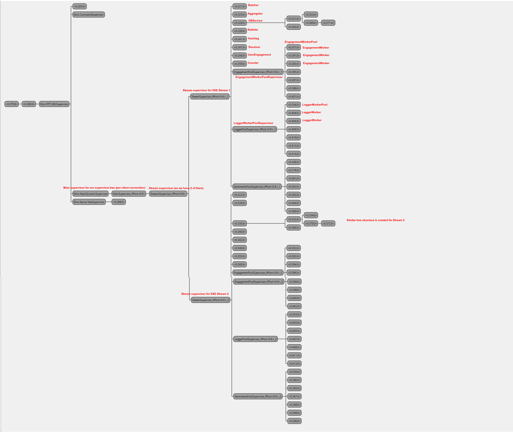

> Pasecinic Nichita
>
> Real-Time Programming in `Elixir`


### **Usage**

```bash
# clone the reporsitory 
$ git clone https://github.com/nichitaa/rtp_sse
# instal dependencies
$ mix deps.get
```

```bash
# pull the docker image
$ docker pull alexburlacu/rtp-server:faf18x
# start the docker container on port 4000
$ docker run -p 4000:4000 alexburlacu/rtp-server:faf18x
```

```bash
# Compile the project and start a new `iex` session inside it
$ iex -S mix
```

```elixir
# Start the builtin observer tool
iex(1)> :observer.start()
```

```bash
# Connect via telnet (any other client) to the server (the application accepts simultaneous connections from multiple terminal - clients)
$ telnet localhost 8080
```

```bash
# run the twitter command
twitter
```

See available configurations [here](./config/config.exs). To inspect and understand better the system is recommended to set following flags:

```elixir
enable_autoscaler: false,
ignore_panic_message: true,
streams_no: 1
```

----


### **Core**

### `Server`
A simple `TCP` server from the [docs](https://elixir-lang.org/getting-started/mix-otp/task-and-gen-tcp.html). It accepts connections on given port (`8080` in my case) and spawns other tasks (under `Task.Supervisor` `Server.TaskSupervisor`) that servers the requests (parses and runs the `twitter` command via `Command` module).

### `Command`
Utility to parse and run a client command (handling only`twitter` command for now).

### `MainSupervisor`
Application main supervisor all other supervisors or actors will start under this one. Currently it starts only a single supervisor `StreamSupervisor` 

### `StreamSupervisor`
The supervisor for a single SSE Stream, all actors related to the tweet processing stream will be started under `StreamSupervisor`. Currently it starts actors as `Statistic`, `Hashtag`, `DBService`, `Receiver`,  `UserEngagement`, `Batcher`, `Aggregator` and 3 workers pools of `Worker.Sentiment`, `Worker.Engagement`, `Worker.Logger`

### `WorkerPool`
A generic implementation for a worker pool. It will handle routing the messages to workers, auto-scale the workers pool, load balancing, starting, terminating and monitoring the workers. A simple usage would be

```elixir
{:ok, worker_pool_pid} = DynamicSupervisor.start_child(
      YourWorkerPoolDynamicSupervisor, # a worker pool is required to be started under a dynmic supervisor
      {
        WorkerPool,
        d(
          %{
            pool_supervisor_name: YourWorkerPoolDynamicSupervisor,
            worker: Worker.Sentiment, # The actual workers
            workerArgs: %{:some: "initial args for your workers"}, 
          }
        )
      }
    )
```


### **App** (`App.ActorName`)

### `Receiver`
It starts a new `EventsourceEx` session for the given SSE stream `url`, passing the received `tweet.data` to the given worker pool `PID` and sending a `{:increment}` message to given `Counter` `PID`

### `Statistic`
Calculates some statistics for a configured time-frame: execution time percentile (75%, 85%, 95%) for a bulk insert of a bulk insert for `users` and `tweets` collections, for `Worker.Logger` tweet processing time (actually sleep time), their crash number and ingested users and tweets.

### `Hashtag`
Calculates the hashtag occurrences and it dumps it into a JSON file.

### `Aggregator`
An actor that is being started for each SSE stream. In its' internal state saves the data aggregated - received from the `Sentiment` and `Engagement` workers, so when a tweet was fully processed by the workers the aggregator will forward the scores and tweet to be further handled by the `Batcher`. The `Aggregator` main internal state `Maps` are: `tweets_sentiment_scores` and `tweets_engagement_scores`.

```elixir
%{
	"123123": %{
		score: 0.2,
		original_tweet: %{ 
			# original tweet data here
		},
		# other fields used on score calculation
	}
}
```

The key for each `Map` value is the tweet id. Once for a tweet there exists values in both of the above `Map`s then the tweet is being removed from the `Map` and send to the `Batcher`.

### `Batcher`
Accumulates the tweets with their scores from the `Aggregator` into batches of a configurable size limit and time frame (see `config.exs`), then perform a bulk upload once is encountered the limit or it ticks the time frame interval by sending to `DBService` the `tweets` and `users` data.

### `UserEngagement`
Another batcher that only works with tweet engagement score, it saves them as a list in a `Map` with user ID as key. It has as well a configurable time frame for doing a bulk insert / update on users engagement ratio via `DBService`

### `DBService`
`MongoDB` was selected to be the application database because of [the greatest elixir driver for mongodb](https://github.com/zookzook/elixir-mongodb-driver) that supports bulk writes. It is used by `Batcher` and has some utility methods for inserting multiple documents to `tweets` and `users` collections as well as for inserting / updating the engagement ratio per user. It does an extremely fast `Mongo.UnorderedBulk.write` and it was used `Stream` API to optimize and reduce the memory usage even more. See `config.exs` for max bulk size for Stream and max bulk size for processing a collection.


### **Workers** (`Worker.WorkerName`)

### `Engagement`
Calculates the engagement score of a tweet based on the following formula `score = (favorites + retweets) / followers`. Sends to the `Aggregator` and `UserEngagement` the score together with all formula arguments.

### `Sentiment`
Computes the sentiments score based on tweet text. We have [this huge](./lib/rtp_sse/tweet_processor/emotion_values.ex) map of word-score values that we look in for each word from a tweet, `score` is equal with the mean of those values.

### `Logger`
Each tweet will go thru it, and will be firstly displayed on the client terminal. The Logger worker will handle panic messages and parsing tweet data, then it will route the tweet to the`Sentiments` and `Engagement` worker pools as well as to the `Hastag` statistic actor.


----

Visual representation of supervision tree with `:observer` tool




-----

### **References**

*  [elixir-lang - `Task` and `:gen_tcp`](https://elixir-lang.org/getting-started/mix-otp/task-and-gen-tcp.html) 
*  [HexDocs - `DynamicSupervisor`](https://hexdocs.pm/elixir/1.13.2/DynamicSupervisor.html)
*  [Medium - Elixir Pubsub TCP with `gproc` Broadcasting](https://medium.com/finally-functional/elixir-pubsub-tcp-with-gproc-broadcasting-ca20b59f12d6)
*  [GitHub - A simple round robin load balancer implementation in Elixir](https://github.com/Xetera/load-balancer)
*  [GitHub -`:eventsource_ex` Elixir `EventSource` (Server-Sent Events) client](https://github.com/cwc/eventsource_ex)
*  [GitHub - `:poison` - An incredibly fast, pure Elixir JSON library](https://github.com/devinus/poison)
*  [Manageengine - Percentile Calculation](https://www.manageengine.com/network-monitoring/faq/95th-percentile-calculation.html)

- [GitHub - `:mongodb_driver` - An alternative Elixir driver for MongoDB](https://github.com/zookzook/elixir-mongodb-driver)
- [GitHub - `elixir-statistics` - Statistical functions and distributions for Elixir](https://github.com/msharp/elixir-statistics)