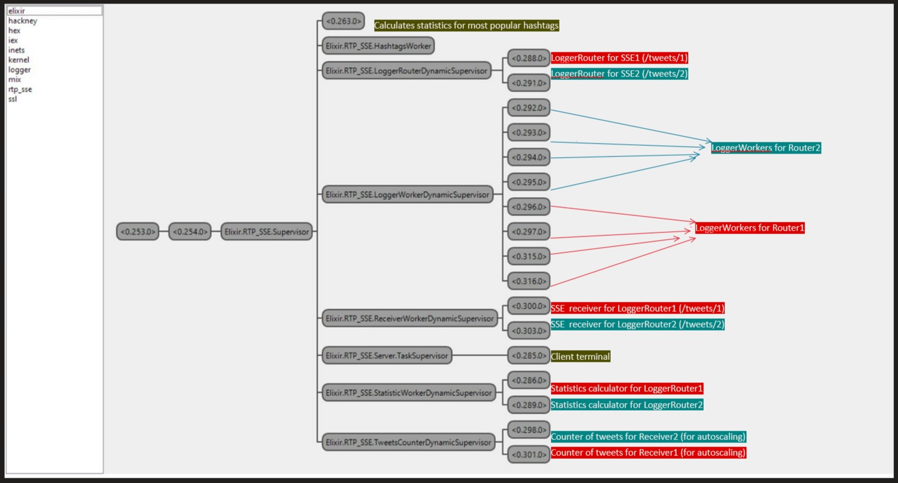

> Pasecinic Nichita
>
> Real-Time Programming in `Elixir`


### **Usage**

```bash
# clone the reporsitory 
$ git clone https://github.com/nichitaa/rtp_sse
# instal dependencies
$ mix deps.get
```

```bash
# pull the docker image
$ docker pull alexburlacu/rtp-server:faf18x
# start the docker container on port 4000
$ docker run -p 4000:4000 alexburlacu/rtp-server:faf18x
```

```bash
# Compile the project and start a new `iex` session inside it
$ iex -S mix
```

```elixir
# Start the builtin observer tool
iex(1)> :observer.start()
```

```bash
# Connect via telnet (any other client) to the server (the application accepts simultaneous connections from multiple terminal - clients)
$ telnet localhost 8080
```

```bash
# run the twitter command
twitter
```

```elixir
# see hashtags statistics

# displayed inside terminal
iex(1)> RTP_SSE.HashtagsWorker.show_stats() 

# or save to .json file
iex(1)> RTP_SSE.HashtagsWorker.download_stats() 
```


### **Inspect `Elixir` Observer tool**



### **References**

*  https://elixir-lang.org/getting-started/mix-otp/task-and-gen-tcp.html
*  https://hexdocs.pm/elixir/1.13.2/DynamicSupervisor.html
*  https://medium.com/finally-functional/elixir-pubsub-tcp-with-gproc-broadcasting-ca20b59f12d6
*  https://github.com/Xetera/load-balancer
*  https://github.com/cwc/eventsource_ex
*  https://github.com/devinus/poison
*  https://www.manageengine.com/network-monitoring/faq/95th-percentile-calculation.html

- https://github.com/zookzook/elixir-mongodb-driver