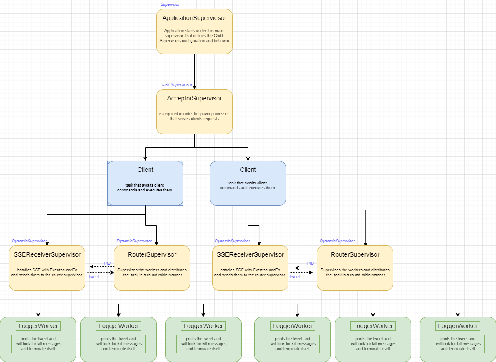

> Pasecinic Nichita
>
> Real-Time Programming in `Elixir`

### **References**

*  https://elixir-lang.org/getting-started/mix-otp/task-and-gen-tcp.html
*  https://hexdocs.pm/elixir/1.13.2/DynamicSupervisor.html
*  https://medium.com/finally-functional/elixir-pubsub-tcp-with-gproc-broadcasting-ca20b59f12d6
*  https://github.com/Xetera/load-balancer
*  https://github.com/cwc/eventsource_ex
*  https://github.com/devinus/poison