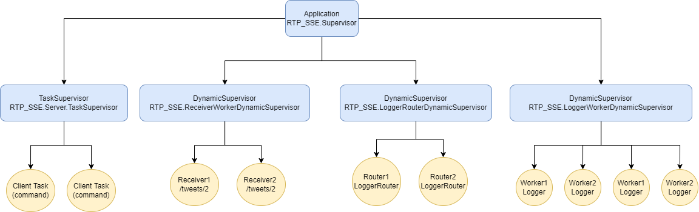
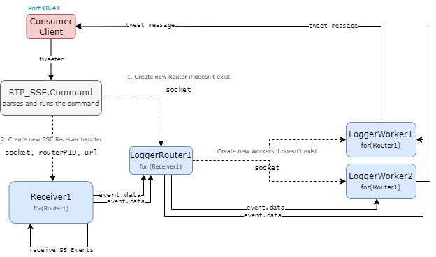

> Pasecinic Nichita
>
> Checkpoint 1
>
> Real-Time Programming in `Elixir`


### **`RTP_SSE` Core Actors**


### `Server`
A simple `TCP` server from the [docs](https://elixir-lang.org/getting-started/mix-otp/task-and-gen-tcp.html). It accepts connections on given port (`8080` in my case) and spawns other tasks (under `Task.Supervisor` `Server.TaskSupervisor`) that servers the requests (parses and runs the `twitter` command via `Command` module).

### `ReceiverWorker`
A basic receiver `GenServer` for the handling the incoming Server Sent Events for a given socket (client), URL (SSE endpoint, `/tweets/1` and `/tweets/2`) and router (`LoggerRouter` actor). It sets up new `EventsourceEx` that streams the events from `url` to itself and it recursively wait for new events by defining the `receive` call-back and sends the received `event.data` to the given `LoggerRouter` (`routerPID` is saved in internal state).

### `LoggerRouter`
Starts several `LoggerWorkers` under the `LoggerWorkerDynamicSupervisor`, so in case a worker dies because of the panic message it will apply the restart policy and start a new one. It keeps the workers (`children`), counter (`index`), and socket into the state so that it can delegate the received `event.data` for a specific worker in a round robin circular order. The `handle_cast({:route, tweet_data}, state)` call-back receives the `event.data` (tweet_data in here) from the  `ReceiverWorker` and passes it to the `LoggerWorker` linked to this `LoggerRouter` actor.

### `LoggerWorker`
The actual workers that are parsing the tweet data and if a `panic` message is received it will kill itself by raising an error, otherwise it will just send the message to the socket (client) via `:gen_tcp.send(socket, msg)`. The only needed `API` for this worker is `handle_cast({:log_tweet, tweet_data}, state)`, that is being called by the `LoggerRouter`

## **[`TweetProcessor` Actors ](./checkpoint_1_lab2.md)**


### **Usage**

```bash
# Compile the project and start a new `iex` session inside it
$ iex -S mix
```

```elixir
# Start the builtin observer tool
iex(1)> :observer.start()
```

```bash
# Connect via telnet (any other client) to the server
$ telnet localhost 8080
```

```bash
# run the twitter command
twitter
```

### **Supervisor diagram** `v1.1`




### **With `Elixir` Observer**

```elixir
iex(1)> :observer.start()
```


### **Message exchange diagram**


