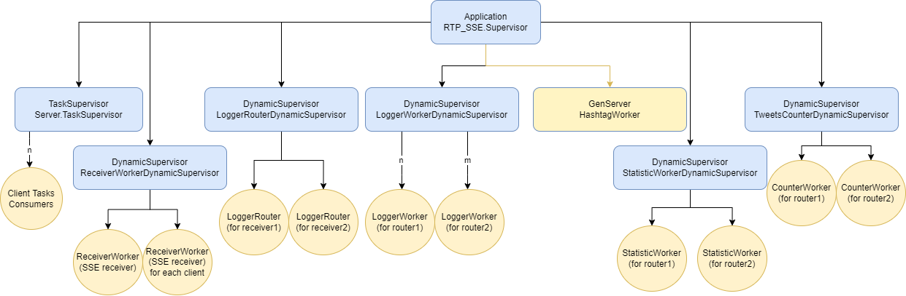
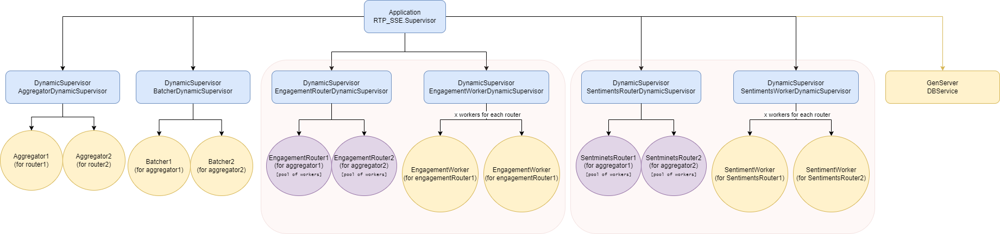
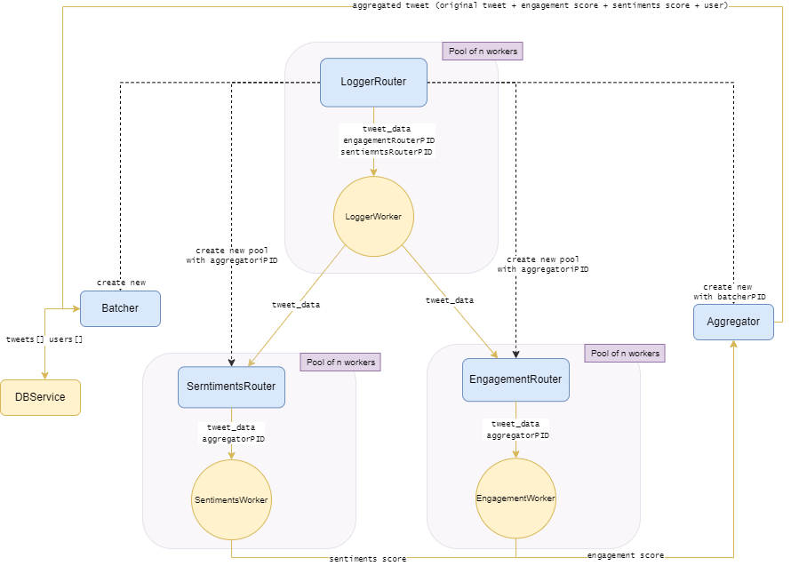

> Pasecinic Nichita
>
> Checkpoint 1 - 12.03.2022
>
> Real-Time Programming in `Elixir`


### **[`RTP_SSE` Core Actors ](./checkpoint_1.md)**


Following the logic from [first part](./checkpoint_1.md), was added some additional functionalities and responsibilities on the core `RTP_SSE.LoggerRouter`. Now, besides basing handling of the `LoggerWorker` workers, it starts as well a few more `TweetProcessor` actors.

1.  Starts the `Batcher` and `Aggregator` (passing the batcher `PID` to the `Aggregator`)
2. Start 2 more worker pools: `EngagementRouter` & `SentimentsRouter` and saves their `PID`s in the internal state as the `LoggerWorker`s should communicate with both of the newly added worker pools


-------


### **`TweetProcessor` Actors**


### `SentimentsRouter`

Pool of `SentimentWorker` workers - started under `SentimentsRouterDynamicSupervisor` supervisor. It autoscores the child workers, it **safely** terminates the worker process, so no data is being lost and as well it passes the received `tweet_data` to a worker in a round robin fashion. It keeps in its internal state the `Aggregator` `PID` that workers are using to send the calculated tweet score to it.


### `EngagementRouter`

Pool of `EngagementWorker` workers - started under `EngagementRouterDynamicSupervisor` supervisor. Has the same functionalities as `SentimentsRouter` , it just operates on a different workers.


### `SentimentWorker`

`SentimentsRouter` worker that asynchronously computes the sentiments score based on tweet text. We have [this huge](./../lib/rtp_sse/tweet_processor/emotion_values.ex) map of word-score values that we look in for each word from a tweet, `score` is equal with the mean of those values.


### `EngagementWorker`

`EngagementRouter` worker that asynchronously calculates the engagement score of a tweet based on the following formula `score = (favorites + retweets) / followers`. Sends to the `Aggregator` the score together with all formula arguments.


### `Aggregator`

An actor that is being started for each `LoggerRouter` (for each SSE stream). In its' internal state saves the data aggregated - received from the above workers, and the `Batcher` `PID` so when a tweet was fully processed by the workers and the aggregator knows this data it will forward the scores and tweet to be further handled by the `Batcher`. The `Aggregator` main internal state `Maps` are: `tweets_sentiment_scores` and `tweets_engagement_scores`.

```elixir
%{
	"123123": %{
		score: 0.2,
		original_tweet: %{ 
			# original tweet data here
		},
		# other fields used on score calculation
	}
}
```

The key for each `Map` value is the tweet id. Once for a tweet there exists values in both of the above `Map`s then the tweet is being removed from the `Map` and send to the `Batcher`.


### `Batcher`

Accumulates the tweets with their scores from the `Aggregator` into batcher of a configurable size limit (`@max_batch_size 200`) and time frame (`@flush_time 3000`) then perform a bulk upload once is encountered the limit or it ticks the time frame interval by sending to `DBService` the `tweets` and `users` data.


### `DBService`

`MongoDB` was selected to be the application database because of [the greatest elixir driver for mongodb](https://github.com/zookzook/elixir-mongodb-driver) that supports bulk writes. It is an actor (used by `Batcher`) that has some utility methods for inserting multiple documents to `tweets` and `users` collections. It does an extremely fast `Mongo.UnorderedBulk.write` with a limit of `@max_bulk_size 50` (so max of 4 bulk writes / requests to Mongo for our 200 `Batcher` `max_batch_size` limit), as well it was used `Stream` API to optimize and reduce the memory usage even more.


-----


### **Usage**

```bash
# Compile the project and start a new `iex` session inside it
$ iex -S mix
```

```elixir
# Start the builtin observer tool
iex(1)> :observer.start()
```

```bash
# Connect via telnet (any other client) to the server
$ telnet localhost 8080
```

```bash
# run the twitter command
twitter
```


------


### **Supervisor diagram** `v3`



### **Extended with**



### **Message exchange** (only for extended supervisor diagram)

**Note:** The bellow diagram is for a **single** `LoggerRouter` that is a worker pool of `LoggerWorkers` that is used to delegate the tweets for a single `SSE` Stream. In our case there are 2 streams (for `/tweets/1` and `/tweets/2`), so we will have 2 `LoggerRouter`s so the diagram will multiply with exactly the same data flow for the second `LoggerRouter`. As well in our system can be as many client connections as we want, so for each client connection that will process `twitter` command there will be created a exactly the same structure of actors from top to bottom. The communication between the each pool of workers and actual workers and other actors is asynchronously.


